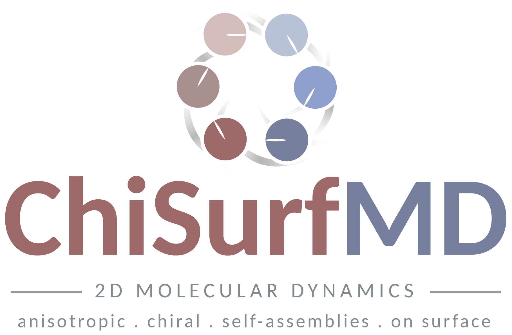
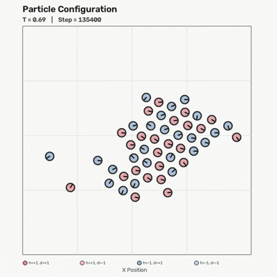
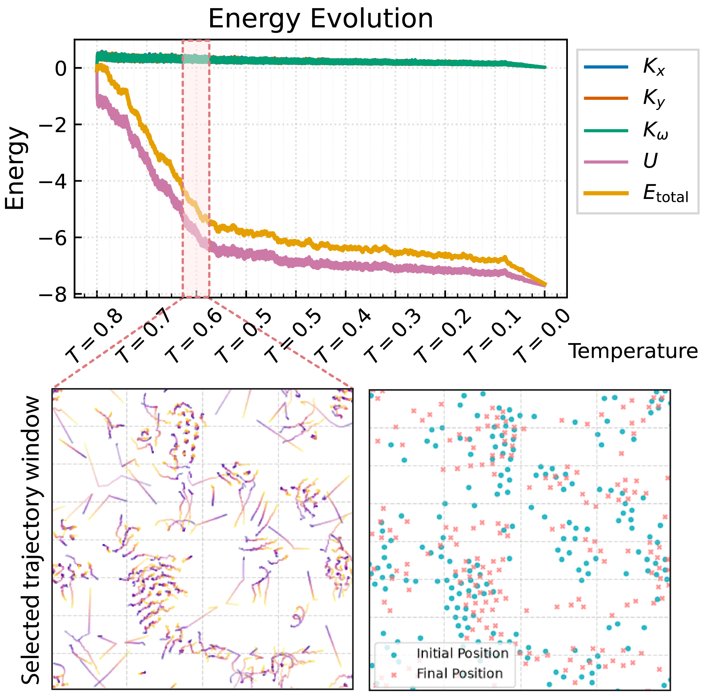
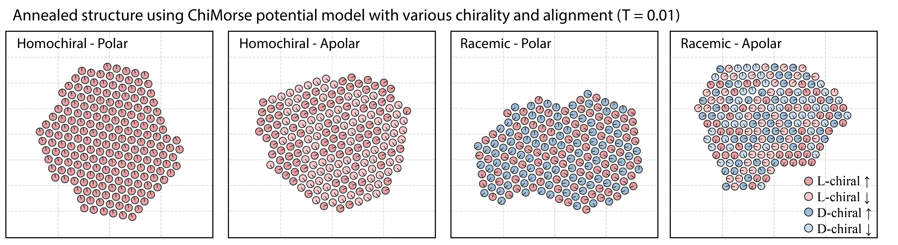
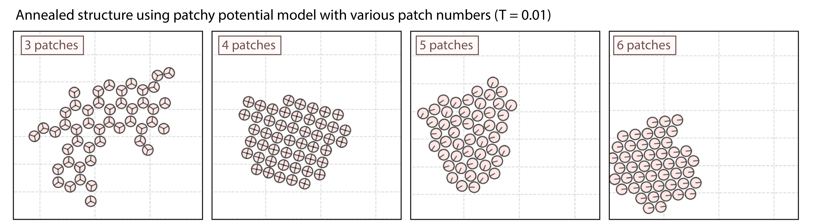
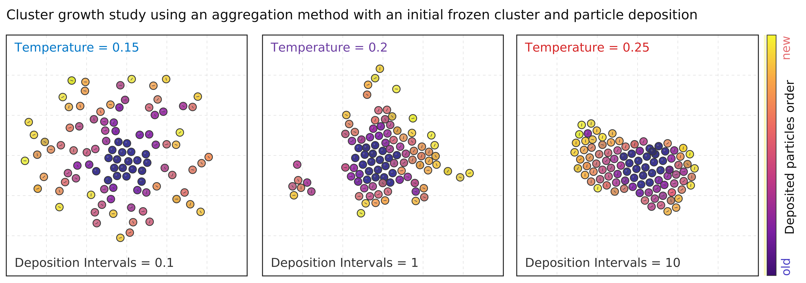
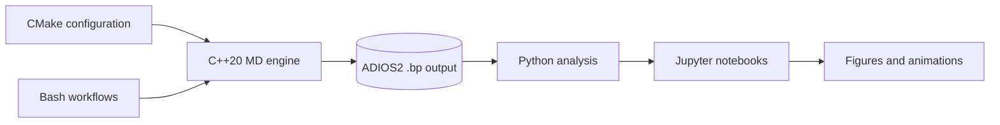

<p align="center">
  
</p>

<p align="center">
  <strong>A modular C++20 molecular-dynamics framework for two-dimensional particle systems with anisotropic and chiral interactions.</strong>
</p>

<p align="center">
  
  
  
  
  
</p>

ChiSurfMD is a research-oriented molecular-dynamics framework for
**two-dimensional particle systems with configurable interaction models**. It
combines a template-based C++20 simulation core with ADIOS2 output, scripted
simulation workflows, and Python/Jupyter analysis and visualization.

The framework was developed for surface self-assembly of anisotropic and
chiral particles, while keeping particle models, interaction potentials,
integrators, thermostats, and simulation protocols sufficiently modular to
support other custom 2D interaction studies. ChiSurfMD is intended for
specialized small-to-medium simulations and rapid model development rather
than as a replacement for general-purpose MD packages such as LAMMPS or
GROMACS.

## Contents

- [What ChiSurfMD does](#what-chisurfmd-does)
- [Demonstration at a glance](#demonstration-at-a-glance)
- [Architecture](#architecture)
- [Build](#build)
- [Simulation workflows](#simulation-workflows)
- [Interaction models](#interaction-models)
- [Output](#output)
- [Analysis and visualization](#analysis-and-visualization)
- [Repository structure](#repository-structure)
- [Scope](#scope)
- [Citation](#citation)
- [License](#license)

## What ChiSurfMD does

| Stage | Capability |
|---|---|
| **Particles** | Simulate translational or orientable particles in two dimensions. |
| **Interactions** | Select among isotropic, anisotropic, patchy, tabulated, and ChiMorse potentials. |
| **Dynamics** | Combine interchangeable integration and temperature-control schemes. |
| **Workflows** | Run individual trajectories, temperature schedules, deposition, and aggregation studies. |
| **Output** | Write trajectory and observable data using ADIOS2 `.bp` files. |
| **Analysis** | Extract, analyze, visualize, and animate simulations with Python and Jupyter. |
| **Reproducibility** | Use seeded simulations, configuration scripts, and parameter-sweep workflows. |

The framework separates the molecular-dynamics engine from the physical model
and analysis layer, making it practical to prototype and compare custom
interaction models without rewriting the full simulation workflow.

## Demonstration at a glance

The examples below illustrate three types of simulations supported by the
framework: anisotropic molecular annealing, patchy-particle self-assembly, and
deposition-driven aggregation.

### Annealing with the ChiMorse interaction

ChiSurfMD can evaluate the Fourier–Morse interaction generated by the
independent [ChiMorse](https://github.com/hadis-gh/chimorse) package and use it
directly in molecular-dynamics simulations. The example below shows an
annealing trajectory together with energy/trajectory diagnostics and selected
low-temperature configurations.

<div align="center" style="line-height: 0;">
  
  
</div>

### Patchy-particle annealing

Alternative interaction models can be explored using the same simulation
infrastructure. Here, patch number and geometry modify the structures produced
during annealing.

<p align="center">
  
</p>

### Particle aggregation

The aggregation workflow combines particle deposition with MD relaxation,
allowing cluster growth to be studied as a function of temperature and
deposition interval.

<p align="center">
  
</p>

These examples are intended to show the simulation and analysis capabilities
of the framework. Detailed physical interpretation of the ChiMorse interaction
and its chirality/alignment classes belongs to the associated scientific study.

## Architecture

The particle representation, interaction potential, thermostat, numerical
integration, output, and analysis layers are kept separate so that the same
simulation workflow can be reused with different physical models.



At the C++ level, generalized positions and velocities allow the integration
and analysis routines to operate on both translational and orientable
particles.

### Core components

- **Particle representations**
  - `ParticleDot`: translational motion in \(x,y\)
  - `ParticleOriented`: translational motion plus orientation \(\phi\)

- **Integration schemes**
  - Velocity Verlet
  - Symplectic Euler
  - Explicit Euler

- **Temperature control**
  - Andersen thermostat
  - Berendsen thermostat
  - velocity scaling
  - thermostat-free dynamics

The active particle, potential, and thermostat types are selected during CMake
configuration, while simulation parameters and workflow settings are supplied
at runtime or through scripts.

## Build

### Requirements

- C++20 compiler
- CMake 3.20 or newer
- Boost `program_options`
- ADIOS2
- Python/Jupyter for analysis
- GNU `parallel` for parallel aggregation sweeps (optional)

### Configure and compile

A typical oriented-particle build is:

```bash
cmake -S . -B build \
    -DCMAKE_BUILD_TYPE=Release \
    -Dchisurfmd_PARTICLE=ParticleOriented \
    -Dchisurfmd_POTENTIAL=OrientedLJ \
    -Dchisurfmd_THERMOSTAT=ThermostatID::Andersen

cmake --build build -j
```

If ADIOS2 is installed in a non-standard location, its CMake directory can be
provided during configuration:

```bash
cmake -S . -B build \
    -DAdios2_DIR=/path/to/adios2/lib/cmake/adios2
```

The main executables are:

```text
build/examples/chisurfmd_md
build/examples/chisurfmd_aggregation
```

Use `--help` to inspect the available runtime options:

```bash
./build/examples/chisurfmd_md --help
./build/examples/chisurfmd_aggregation --help
```

## Simulation workflows

The `scripts/` directory provides reusable workflows around the compiled
executables.

### Single trajectory

Runs one molecular-dynamics trajectory for a selected particle model,
potential, thermostat, temperature, and initial configuration.

```bash
cd scripts
./run_single.sh <config.sh>
```

### Temperature annealing and heating

Runs sequential MD simulations over a temperature schedule. The final
configuration at one temperature initializes the next step.

```bash
cd scripts
./run_annealing.sh <config.sh>
```

### Aggregation

Combines particle deposition with MD relaxation to study cluster growth as a
function of temperature and deposition interval.

```bash
cd scripts
./run_aggregation.sh <config.sh>
```

## Interaction models

The active interaction model is selected at build time.

| Potential | Oriented particles | Purpose |
|---|:---:|---|
| `IsotropicLJ` | — | Standard isotropic Lennard–Jones interaction |
| `OrientedLJ` | ✓ | Lennard–Jones interaction with angular dependence |
| `GeometricLJ` | ✓ | Geometry-based orientation-dependent interaction |
| `PatchyLJ` | ✓ | Discrete attractive patch interactions |
| `ChiralPatchyLJ` | ✓ | Patchy interaction with handedness dependence |
| `TabularDFT` | ✓ | Interaction defined from tabulated external data |
| `ChiMorse` | ✓ | Fourier-parameterized anisotropic Morse interaction |

This separation makes the simulation engine useful both for testing simplified
model interactions and for running analytical or tabulated potentials derived
from external calculations.

## Output

Simulation data are written as ADIOS2 `.bp` files. Depending on the selected
particle model and workflow, output can include:

- time;
- generalized positions and velocities;
- handedness and alignment labels;
- kinetic and potential energy;
- translational and rotational temperature;
- neighbor counts;
- orientational order;
- center-of-mass quantities.

Particle-state and observable output intervals can be controlled independently
of the MD integration time step.

## Analysis and visualization

The `notebooks/` directory provides the Python/Jupyter analysis layer for
reading ADIOS2 output, inspecting trajectories, computing structural
quantities, and generating figures or animations.

| Notebook / module | Purpose |
|---|---|
| `01_Potential.ipynb` | Inspect interaction-potential surfaces. |
| `02_MD_Single_File.ipynb` | Analyze a single trajectory. |
| `03_MD_Temperature_Loop.ipynb` | Analyze annealing/heating simulations. |
| `04_MD_Aggregation.ipynb` | Analyze cluster-growth simulations. |
| `data_extraction.py` | Read and organize ADIOS2 simulation output. |
| `system_analysis.py` | Structural and cluster analysis. |
| `visualization.py` | Configuration, trajectory, observable, and animation tools. |

The analysis layer is intentionally separate from the C++ simulation core so
that simulation output can be inspected and post-processed without coupling
visualization logic to the MD engine.

## Repository structure

```text
chisurfmd/
├── include/chisurfmd/
│   ├── core/          # particle models, vectors, species, utilities, energy
│   ├── md/            # integration and thermostats
│   └── potential/     # interaction models
├── examples/          # simulation drivers
├── scripts/           # single, annealing, and aggregation workflows
├── notebooks/         # analysis and visualization
├── assets/            # representative figures and animations
├── CMakeLists.txt
├── LICENSE
└── README.md
```

## Scope

ChiSurfMD is a compact research code for custom two-dimensional interaction
models and self-assembly studies. The current implementation uses direct
pairwise force evaluation and is therefore best suited to small-to-medium
systems rather than large-scale production molecular dynamics.

The project was developed as part of a broader multiscale simulation workflow,
but ChiSurfMD can be used independently: ChiMorse is one supported interaction
model rather than a required dependency of the simulation framework.

## Citation

If you use ChiSurfMD in research, please cite the software release and relevant
scientific work when public citation information is available.
Machine-readable citation metadata are provided in [`CITATION.cff`](CITATION.cff).

## License

ChiSurfMD is released under the **MIT License**. See [`LICENSE`](LICENSE) for
details.
