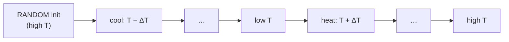
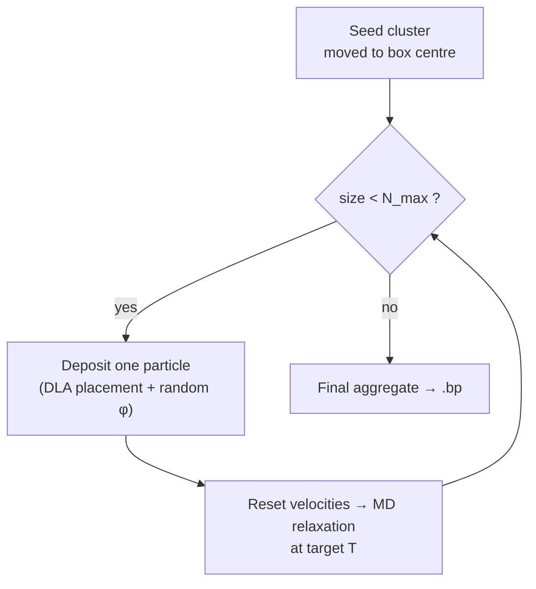

<p align="center">
  
</p>

<!-- <h1 align="center">lettuce&nbsp;·&nbsp;MD</h1> -->

<p align="center">
  <em>A 2D molecular-dynamics engine for anisotropic, chiral, patchy-particle self-assembly</em>
</p>

<p align="center">
  
  
  
  
</p>

---

## Overview

This repository is a research portfolio piece containing the molecular-dynamics architecture I developed to study the **self-assembly of orientation-dependent and chiral particles in two dimensions**. It features a generic, template-based C++ core paired with a fully automated, config-driven Bash-to-Python pipeline.

The design prioritizes clean separation of concerns: the **particle model, interaction potential, integrator, and thermostat are independent, composable compile-time policies**. This allows for rapid iteration on physics questions without rewriting the core loop. Bash orchestration handles complex parameter sweeps (like temperature annealing and diffusion-limited aggregation), while a modular Python layer translates the binary streams into high-quality visualizations.

> **Note:** This repository is intended to demonstrate modular code architecture and scientific-computing workflows for academic review. It is not packaged for general third-party installation.

---

## Key Results

> *Replace these placeholders with your best Jupyter notebook outputs. A PI should see your physics working immediately.*

<p align="center">
  
  &nbsp;&nbsp;
  
</p>
<p align="center">
  <em>Left: DLA deposition sequence showing chiral alignment. Right: (T, deposition-rate) heatmap of orientational order.</em>
</p>

---

## Contents

- [Pipeline at a Glance](#pipeline-at-a-glance)
- [The C++ Engine](#the-c-engine)
- [Simulation Workflows](#simulation-workflows)
- [Analysis & Visualization](#analysis--visualization)
- [Build & Run Reference](#build--run-reference)

---

## Pipeline at a Glance

A single `config.sh` parameterizes the entire run. Bash scripts dispatch the compiled C++ engine, which streams trajectories and observables to **ADIOS2 `.bp`** files. The Python analysis layer then automatically ingests and visualizes the data.

```mermaid
flowchart LR
    A["config.sh<br/>(parameters)"] --> B{"Workflow"}
    B -->|single| S1["run_single.sh"]
    B -->|annealing| S2["run_loop.sh"]
    B -->|aggregation| S3["run_aggregation.sh"]

    S1 --> E1["run_main_MD<br/>(C++ engine)"]
    S2 --> E1
    S3 --> E2["run_aggregation<br/>(C++ engine)"]

    E1 --> O[("ADIOS2 .bp<br/>trajectories + observables")]
    E2 --> O

    O --> P["Python modules<br/>extraction · analysis · visualization"]
    P --> N["Jupyter notebooks<br/>02 / 03 / 04"]
    N --> R["Figures · animations<br/>phase heatmaps"]


---

## The Engine

The core is header-only and generic over the particle type. Algorithms (integration, thermostatting, energy/temperature measurement) are written against a small **generalized-coordinate interface** (`getGeneralizedPositions` / `…Velocities` and their setters), so the same code path drives a translational point particle or a fully oriented rigid body without specialization.

```mermaid
flowchart TD
    subgraph CT["Compile-time policies (CMake cache → macros)"]
        P1["Particle model<br/>ParticleDot (2 DOF) · ParticleOriented (3 DOF)"]
        P2["Interaction potential<br/>Isotropic / Oriented / Geometric / Patchy / Chiral / Morse"]
        P3["Thermostat<br/>VelocityScaling / Berendsen / Andersen / None"]
    end

    P1 --> K["Generalized-coordinate interface"]
    P2 --> K
    P3 --> K
    K --> L["Integrator (runtime-selected)<br/>VelocityVerlet · Euler · SymplecticEuler"]
    L --> M["Event-driven MD loop<br/>(integrate → measure → thermostat)"]
    M --> OUT[("ADIOS2 .bp")]
```

### Particle Models

| Model | DOF | Description |
|---|---|---|
| `ParticleDot` | 2 | Translational point particle (x, y). |
| `ParticleOriented` | 3 | Adds an orientation φ and angular velocity ω; carries handedness/alignment labels for chirality studies. |

Particles support multiple **species** (mass, moment of inertia, exclusion radius) and periodic boundary conditions with the minimum-image convention.

### Interaction Potentials

Each potential is a self-contained factory exposing `force`, `potential`, and its own command-line options; the active one is fixed at build time via `LETTUCE_POTENTIAL`. Force and energy are provided as separate functors for accurate energetics and integration.

| Potential | Orientation | Summary |
|---|:---:|---|
| `IsotropicLJ` | — | Standard 12–6 Lennard-Jones. |
| `OrientedLJ` | ✓ | LJ with a smooth angular term `A·(1 + cos(m·Δφ + α))`; `α` encodes a chiral phase, `m` the rotational order. |
| `GeometricLJ` | ✓ | Explicit off-centre patches; patch–patch LJ interactions with the resulting torque. |
| `PatchyLJ` | ✓ | Discrete attractive surface patches. |
| `ChiralPatchyLJ` | ✓ | Patchy interactions with a handedness-dependent angular offset. |
| `AnisotropicMorse` | ✓ | Orientation-dependent Morse interaction with a Fourier-modulated well. |
| `TabularDFT` | ✓ | Tabulated potential driven by external (e.g. first-principles) data. |

### Integrators &amp; Thermostats

- **Integrators** (runtime, `--integration`): Velocity Verlet (default, symplectic), Symplectic Euler, explicit Euler.
- **Thermostats** (compile-time, `LETTUCE_THERMOSTAT`): velocity rescaling, Berendsen, stochastic Andersen, or none — each generalised to both translational and rotational degrees of freedom.

### Observables

Streamed to `.bp` on independent state/energy intervals:

- positions &amp; velocities (generalized coordinates)
- kinetic energy resolved per DOF (x, y, φ) and potential energy
- per-DOF temperature
- orientational order parameter ⟨cos 2Δφ⟩
- neighbour counts at multiple shell radii
- centre-of-mass velocity and angular momentum
- handedness / alignment labels

---

## Build &amp; run

> Reference steps for reproducing the pipeline on a Linux / HPC environment.

### Prerequisites

- A **C++20** compiler (GCC&nbsp;≥&nbsp;10 or Clang&nbsp;≥&nbsp;12) and **CMake&nbsp;≥&nbsp;3.20**
- **Boost** (`program_options`) and **ADIOS2** — engine and binary I/O
- **GNU&nbsp;parallel** — aggregation parameter sweeps (optional)
- **Python&nbsp;≥&nbsp;3.10** with `numpy`, `matplotlib`, `scipy`, `jupyter`, and the **ADIOS2 Python bindings** (to read `.bp` output)

### Build

The particle model, potential, and thermostat are **compile-time policies**, chosen as CMake cache options; run-time parameters (temperature, step size, …) are supplied later on the command line.

```bash
cmake -B build -DCMAKE_BUILD_TYPE=Release \
      -Dlettuce_md_PARTICLE=ParticleOriented \
      -Dlettuce_POTENTIAL=OrientedLJ \
      -Dlettuce_md_THERMOSTAT=ThermostatID::Andersen
cmake --build build -j
```

This builds the example drivers (`run_main_MD`, `run_aggregation`) under `build/`. Run either with `--help` to list every option.

### Run

Each workflow is launched through a `config.sh` that defines the parameters for a sweep:

```bash
cd scripts
./run_single.sh       config.sh   # one trajectory at fixed T
./run_loop.sh         config.sh   # temperature annealing + heating
./run_aggregation.sh  config.sh   # DLA deposition over a (T, rate) grid
```

Results are streamed to ADIOS2 `.bp` files; open the matching notebook in `notebooks/` to analyse them.

---

## Simulation workflows

All three modes are config-driven and reproducible (seeded RNG).

**1 · Single run** — one trajectory at a fixed temperature (`run_single.sh`).

**2 · Temperature annealing** — `run_loop.sh` starts from a random configuration at high temperature, cools in fixed steps, then re-heats, **chaining each run's final configuration as the next run's initial state**. This produces an ordered sequence of `.bp` files spanning the cooling/heating cycle.



**3 · Diffusion-limited aggregation** — `run_aggregation.sh` runs a two-stage protocol and sweeps a **temperature × deposition-rate grid in parallel** (GNU `parallel`). The deposition driver grows a cluster one particle at a time, relaxing the system with a full MD loop after each addition.



---

## Analysis &amp; visualization

The `notebooks/` build on three Python modules — `data_extraction` (reads `.bp` and assembles parameter sweeps), `system_analysis` (cluster metrics), and `visualization` (plots and animations).

| Notebook | Purpose |
|---|---|
| `02_MD_Single_File` | Single trajectory: energy/temperature traces, neighbour and order-parameter evolution, COM kinematics; configuration snapshots, trajectories, animations; φ and Δφ histograms. |
| `03_MD_Temperature_Loop` | Annealing/heating across temperature: energetics, neighbour counts, and order parameter vs. T; snapshots and orientation histograms at chosen temperatures; full-cycle animation. |
| `04_MD_Aggregation` | Aggregate structure and growth dynamics; **(T, deposition-rate) heatmaps** of orientational order, neighbour number, radius of gyration, convex-hull area, and compactness. |

---

<p align="center"><sub>Research portfolio · computational / theoretical physics</sub></p>
